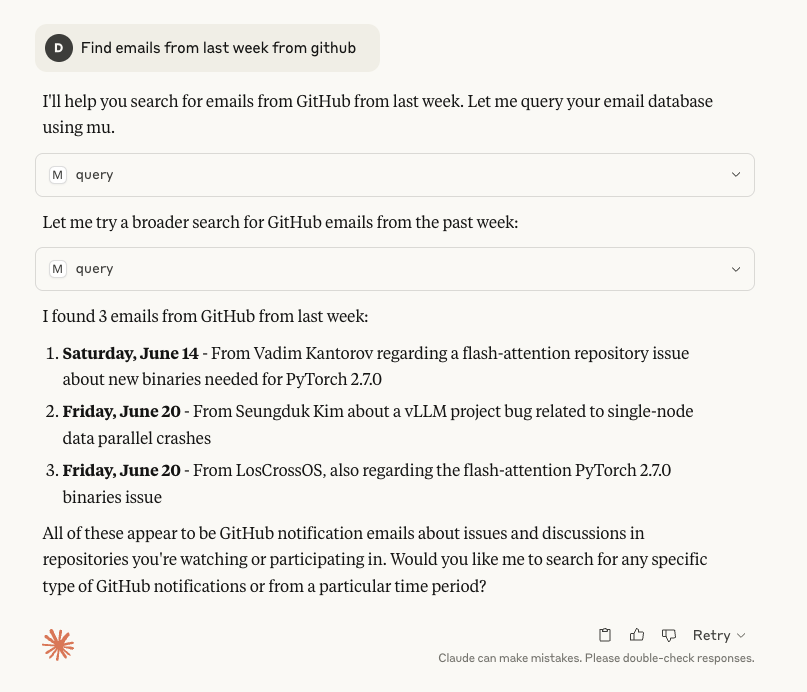

# mu-mcp: MCP Server for the `mu` Mail Indexer

[](https://github.com/danielfleischer/mu-mcp/releases)
[](https://github.com/danielfleischer/mu-mcp/blob/master/LICENSE)

A Model Context Protocol (MCP) server for querying your local [`mu`](https://www.djcbsoftware.nl/code/mu/) mail index. This server enables fast, structured mail search from Claude Desktop and other MCP clients.



## Features

- **Stdio MCP server** for easy integration
- **Two tools:** query and view emails.
- **Fast, flexible mail search** using the `mu` index
- **Claude Desktop ready**: simple installation and config
- **Python, uv, and MCP SDK** based

## Installation

Clone this repository and install dependencies:

```sh
git clone https://github.com/danielfleischer/mu-mcp.git
cd mu-mcp
uv venv
uv pip install .
```

## Usage

### Run the MCP Server

With [uv](https://github.com/astral-sh/uv):

```sh
uv run --directory . mcp run mu_mcp/mu_mcp.py
```

Or directly with Python:

```sh
python mu_mcp/mu_mcp.py
```

### Claude Desktop Integration

Add to your `claude_desktop_config.json`:

```json
"mcpServers": {
  "mu_mcp": {
    "command": "uv",
    "args": [
      "run",
      "--directory",
      "PROJECT_PATH",
      "mcp",
      "run",
      "mu_mcp/mu_mcp.py"
    ]
  }
}
```

Replace `PROJECT_PATH` with the path to your cloned repo.

## Query

Ask Claude to find emails, e.g. "Find emails with a PDF attachment that were sent last April", "Show me the email I received from Alice last week", or "Find emails with the subject 'Meeting Notes'".

## Development

- [x] Adding a tool to view an email.
- [ ] Adding a tool to find and download attachments.
