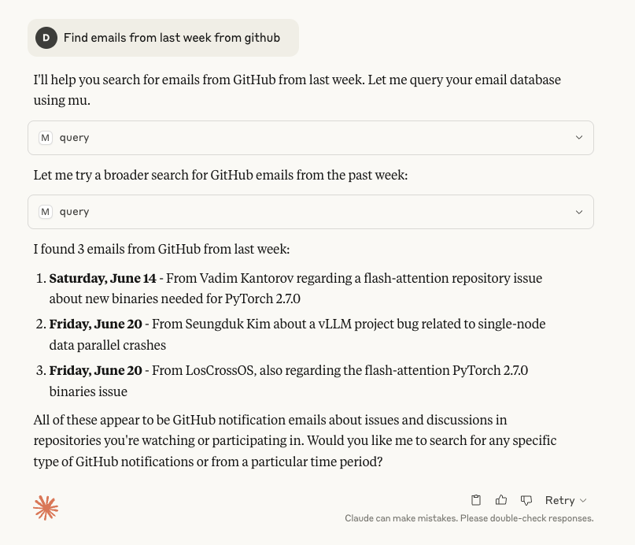

# mu-mcp: MCP Server for the `mu` Mail Indexer

[](https://github.com/danielfleischer/mu-mcp/releases)
[](https://github.com/danielfleischer/mu-mcp/blob/master/LICENSE)

A Model Context Protocol (MCP) server for querying your local [`mu`](https://github.com/djcb/mu) mail index. This server enables fast, structured mail search from Claude Desktop and other MCP clients.



## Features

- **Stdio MCP server** for easy integration
- **Tools:** `search_emails`, `view_emails` (HTML-only emails converted to text), `list_attachments`, `open_attachment` (saves to a temp dir and optionally opens with the default OS viewer), and `mu_help` for the full `mu` reference on demand.
- **Small context footprint:** a short query guide lives in the tool description; the full man pages are only loaded when the model asks for them.
- **Fast, flexible mail search** using the `mu` index
- **Claude Desktop ready**: simple installation and config
- **Python, uv, and MCP SDK** based

## Installation

Requires [`mu`](https://github.com/djcb/mu) installed and your mail indexed (`mu init` + `mu index`).

Clone this repository and install dependencies:

```sh
git clone https://github.com/danielfleischer/mu-mcp.git
cd mu-mcp
uv sync
```

## Usage

### Run the MCP Server

With [uv](https://github.com/astral-sh/uv):

```sh
uv run --directory . mcp run mu_mcp/mu_mcp.py
```

### Claude Desktop Integration

Add to your `claude_desktop_config.json`:

```json
"mcpServers": {
  "email": {
    "command": "uv",
    "args": [
      "run",
      "--directory",
      "PROJECT_PATH",
      "mcp",
      "run",
      "mu_mcp/mu_mcp.py"
    ]
  }
}
```

Replace `PROJECT_PATH` with the path to your cloned repo.

### Claude Code Integration

```sh
claude mcp add email -s user -- uv run --directory PROJECT_PATH mcp run mu_mcp/mu_mcp.py
```

Use `-s local` instead to enable it only in the current project. Check it with `/mcp` in a new session.

## Query

Ask Claude to find emails, e.g. "Find emails with a PDF attachment that were sent last April and open the PDF", "Show me the email I received from Alice last week", or "Find emails with the subject 'Meeting Notes'".

## Development

- [x] Adding a tool to view an email.
- [x] Adding a tool to find and download attachments.
- [x] Progressive disclosure of the `mu` man pages via `mu_help`.

### Future ideas

- [ ] Add a `mu-mcp` console script (`[project.scripts]` + `main()`) so `uvx mu-mcp` works from PyPI; make that the README's install method.
- [ ] Rewrite the server `instructions` around *when* to use it (anything about the user's email, inbox, messages, receipts, attachments) — that's what helps the model find the tools.
- [ ] Return attachment text (PDF, DOCX) from `open_attachment`; Claude Desktop can't read the saved file paths.
- [ ] `view_thread`: show a whole conversation from one message.
- [ ] `find_contacts` via `mu cfind`, to resolve a name to its addresses.

